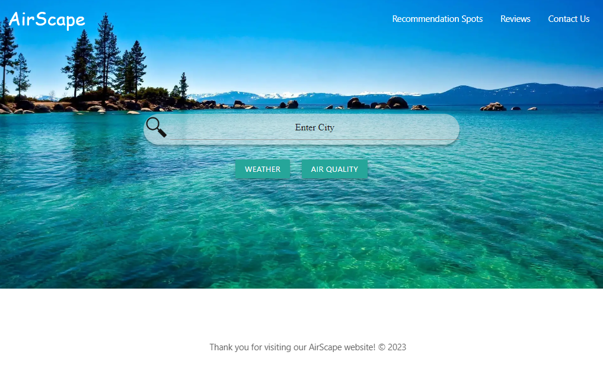

# AirScape

## Description

This readme contains information on the AirScape website created using HTML, CSS, and Javascript. The link to the deployed live site can be found in the "Links" section of this readme. All buttons and links in the deployed website are functioning properly. This AirScape website allows users to search for the current air quality and current weather conditions for cities. The website also contains information on recommended locations, a contact page, and a review page for leaving and viewing reviews.

## Installation

N/A

## Usage

In order to use this website, the user must enter a city into the search bar and choose either "Weather", to search for current weather, or "Air Quality", to search for the current air quality. The user is then given information regarding current air quality or current weather conditions, based on the topic searched for. The user can also choose to navigate to recommended locations, reviews, or a contact page by clicking on the navigation links provided. 

## Links

Github repository URL: https://github.com/JarettDeSanti/Air_Quality_Website  
Portfolio URL: https://jarettdesanti.github.io/JD_Portfolio/  
Deployed live site URL: https://jarettdesanti.github.io/Air_Quality_Website/

## Screenshot

## User Story:

As a person interested in exploring new places, I need to make sure that the weather condtions, including air quality are good, so my resouces of both time and money are invested in a positive experience and not wasted because of poor enviromental conditions.

## Acceptance Criteria:

Given a website that provides information on regional conditions related to weather and air quality:

When I view the opening page,

Then I'm presented with a clean and easy to navigate site, with the name of the website and several buttons that are labeled with the search topics like weather and air quality that I'm interested in.

When I choose a search topic,

Then I can easily use the provided form input to enter the city of the region I'm interested in.

When the search topic I've selected is weather,

Then I'm presented with the current weather information for the city that I selected.

When the search topic I've selected is air quality,

Then I'm presented with the current AQI 'air quality index' based on local conditions such as pollution or wildfire smoke. The forcast will be based on the projected prevailing wind patterns.

## Collaborators

David Melendez, Xueying Li, Jarett DeSanti

## Credits

N/A

## License

Please refer to the LICENSE in the repository.

## Badges
N/A

## Features
N/A

## How to Contribute
N/A

## Tests
N/A
